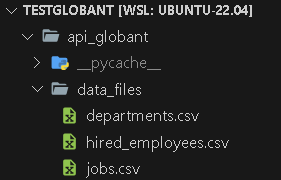
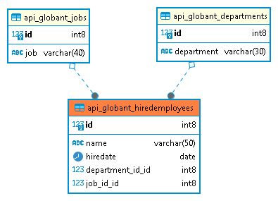
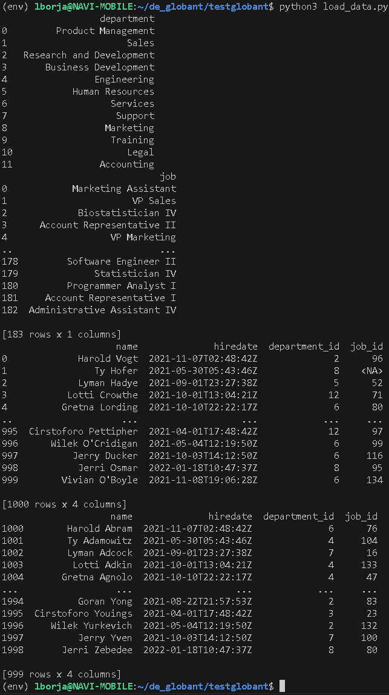
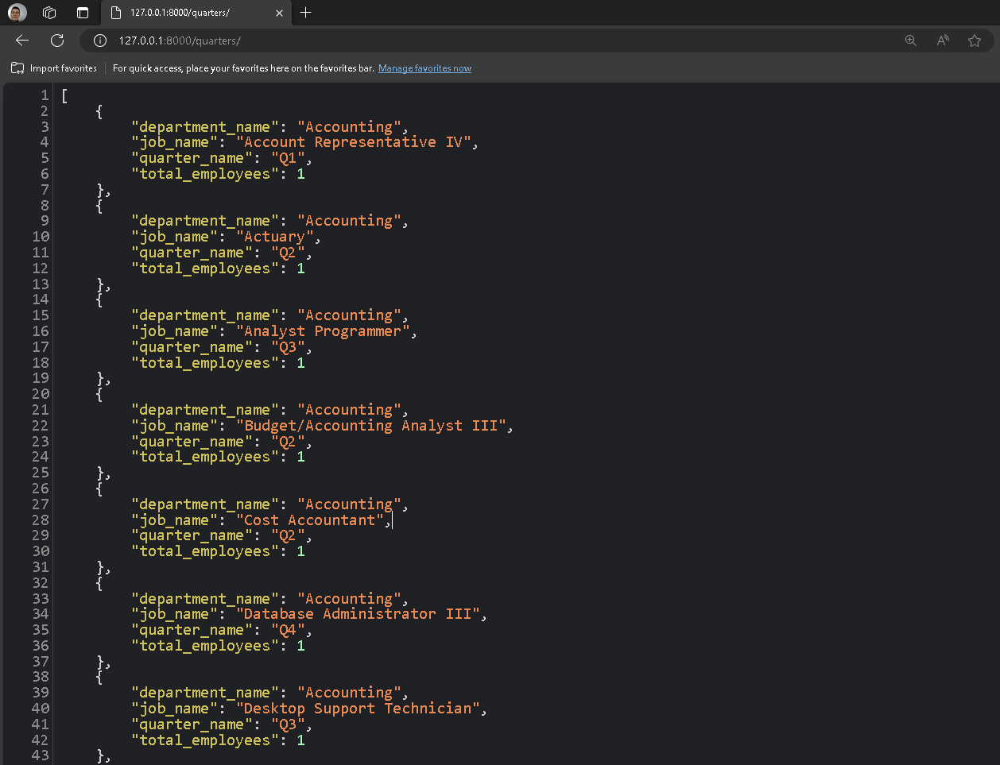
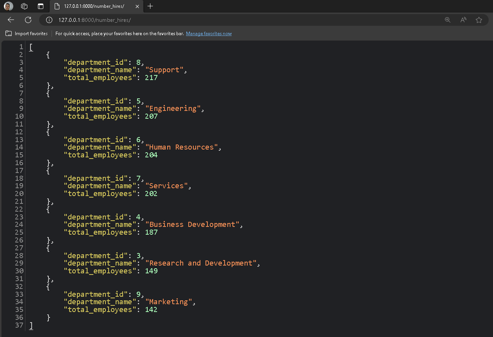

<h1 align="center"> Globant’s Data Engineering Coding Challenge </h1>

In the files I've uploaded to this repository, you'll find the comprehensive breakdown of the code challenge's development.

I've created a Python script to transfer all the data into the PostgreSQL database. Not a single piece of information was disregarded; even the fields with empty values were uploaded. I chose to treat the model akin to a Data Lake with interconnected tables, preserving relationships among specific data.
During the endpoint service, I omitted those specific values as per the stakeholders' requests. This decision was influenced by the ORM query structure, ensuring the results met the intended criteria.

To ensure this exercise runs smoothly, follow these steps:

1. **Setting up the Environment:**
   - Create a Python virtual environment and install all necessary requirements listed in the 'requirements.txt' file.

2. **Environment Configuration for WSL and Windows:**
   - When using a WSL (Windows Subsystem for Linux) machine with the database on Windows, consider the following steps:
     a. Open PowerShell as an administrator.
     b. Execute the following commands to enable communication between WSL and Windows:
        ```
        New-NetFirewallRule -DisplayName "WSL Ping" -Direction Inbound -InterfaceAlias "vEthernet (WSL)" -Action Allow -Protocol ICMPv4
        New-NetFirewallRule -DisplayName "WSL PostgreSQL" -Direction Inbound -InterfaceAlias "vEthernet (WSL)" -Action Allow -Protocol TCP -LocalPort 5432
        ```
3. **Configuring WSL with Windows for Database Communication:**
   - Use the command `ping $(hostname).local` within WSL to obtain the IP address of your local Windows machine. Add this IP address in the 'settings.py' to configure the databases.

4. **Database Configuration:**
   - The default database setup is SQLite.

5. **Data Loading and Execution:**
   - I Upload the data inside the application folder.
   
   - Use the script in the root directory. With the virtual environment activated, execute the command: `python3 load_data.py`.
   - The script should execute correctly and display batch transaction inserts. Refer to the provided image for a demonstration of the script execution.
   

6. **Table Design:**
   - The final table design is depicted in the image below.
   


7. **Endpoint:**
   - For accessing the information on the specified endpoints, it's essential to initialize the server by executing the command: `python manage.py runserver`. After the server starts, visit the following URLs:

      - [Quarters Endpoint](http://127.0.0.1:8000/quarters/)
      - [Number Hires Endpoint](http://127.0.0.1:8000/number_hires/)

     Upon accessing these URLs, you'll view the detailed results for each one:

a. **Quarters Endpoint:**
   
   
b. **Number Hires Endpoint:**
   


By following these steps, you can conveniently access and review the outcomes obtained from each endpoint.